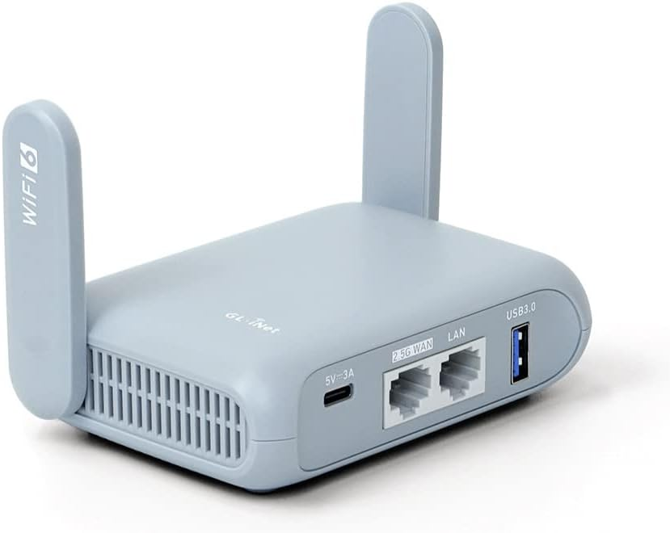

# DahlStar Antenna System

## 1 - Overview

The DahlStar Antenna System consists of an adjustable stepper motor driven loading coil vertical antenna. The design is based on the classic screwdriver antenna. The DahlStar implementation introduces a discrete anti-rotation feature for the loading coil that prevents it from rotating during extension and retraction.

The stepper motor extends or retracts the coil across fingerstock contacts at the top of a 36-inch steel radiating tube which houses the coil and the stepper motor. A smaller diameter radiating copper tube is attached to the upper end of the loading coil. The antenna can be resonantly tuned to any frequency between the 10m to 80m bands.

For impedance matching, a multi-tap unun is located in the electronics housing near the feed point. The taps are selectable via electro-optical relays.

Note that counterpoise wires are needed for optimum operation and are attached at the antenna feed point. For general all-around operation, it was found that the use of 8 wires at 17 feet each placed radially on the ground works well. Other 1/4-wave length wire may be introduced in place of, or in addition to, the 17 foot lengths in order to "sweeten-up" any particular band.  

A contact limit switch is placed just above the stepper motor to sense when the loading coil has reached its fully retracted home position. 

An Arduino with WiFi is used for the system controller. A separate Arduino motor controller shield is used as the stepper motor interface. User control of the antenna system is accomplished via WiFi using a custom software application for MacOS. 

## 2 - System Schematic Diagram

## 3 - Electronic Components

### 3.1 - A1: Arduino Uno RF WiFi Controller

[Arduino Uno R4 WiFi Datasheet](Datasheets/Arduino_R4_WiFi_Datasheet.pdf)

[Arduino Uno R4 WiFi Pinouts](Datasheets/Arduino_R4_WiFi-full-pinout.pdf)

[Arduino Uno R4 Wifi Schematics](Datasheets/Arduino_R4_WiFi-schematics.pdf)

Quantity required: 1

### 3.2 - A2: Arduino Motor Controller Shield R3

[Arduino Motor Controller Shield R3 Schematic](Datasheets/Arduino_Motor_Controller_R3-schematic.pdf)

Optional: To facilitate robust connections, screw terminal blocks can be added to the motor shield.

Quantity required: 1

### 3.3 - A3: Hosyond 0.96 Inch OLED I2C Display Module

[OLED Display Datasheet](<Datasheets/OLED 4 Pin 128x64 Display module 0.96 inch blue color.pdf>)

Quantity required: 1

### 3.4 - A4: Elegoo 8 Channel Relay Module

[Elegoo 8 Channel Relay Module Datasheet](<Datasheets/8 CHANNEL 5V 10A RELAY MODULE.pdf>)

[Relay Datasheet](Datasheets/SRD-05VDC-SL-C.pdf)

[Elegoo 8 Channel Relay Module Schematic](<Datasheets/8 Channel DC 5V Relay Module with Optocoupler Schematic diagram.pdf>)

[Elegoo 8 Channel Relay Module Dimensions](<Datasheets/8 way photocoupler with size chart.pdf>)

Optional: To facilitate robust connections to the pins, proto boards with screw terminal blocks can be added to the relay module. 

Quantity required: 1

### 3.5 - A5: 5V Converter Module / Limit Switch Debounce

The 12V to 5V voltage converter and limit switch debounce was assembled on a protoboard using the following components:

* U1 - L7805 5V Voltage Regulator
* C1 - 47uF 25V Electrolytic Capacitor
* C2 - 47uf 25V Electrolytic Capacitor
* TO220 Heat Sink
* R1 - 10K Ohm 1/4W Resistor
* C3 = 100nF Ceramic Capacitor
* Proto Board

Optional: To facilitate robust wiring connections, screw terminal blocks can be added to the board.

Quantity required: 1

### 3.6 - J1 / J2: SZJELEN SP21 2-Pin Panel Mount 21mm Waterproof Connector

Quantity required: 1

### 3.7 - J3: USB-C Connector / Jumper

An 90-degree USB-C adapter facilitates easier connection of the jumper to the Arduino.

Quantity required: 1

### 3.8 - J4: Screw Terminal Bus Bar

Quantity required: 1

### 3.9 - J5: SO239 Antenna Connector

Quantity required: 1

### 3.10 - L1: Multi-Tap UNUN Assembly

Quantity required: 1

The multi-tap unun has 15 turns of 18 gage enameled wire bi-filar wound around a T106-2 toroidal core. Taps are taken at windings 9 through 13 on the "A" wire. The tap wires are crimped to the main winding followed by soldering the crimp and covering with shrink tubing. Note: Be sure to carefully remove the enamel from the wires locally before crimping. This implementation used separate wires for winding A and winding B, so an additional crimp is needed to join them.

To facilitate the unun connections to the system wiring, mini banana plug fittings were installed on the ends of the tap wires.

The unun requires fabrication from the following:

#### 3.10.1 - UNUN Core

Quantity required: 1

#### 3.10.2 - 18 GA Enameled Wire

Note: Don't forget to sand off the enamel wire insulation wherever an electrical connection is made.

Quantity required: 72 inches

### 3.11 - L2: Loading Coil Assembly

The loading coil is made by winding 18 GA bare copper wire around the coil form. Images and assembly details are provided in Section 5. 

NOTE: DO NOT USE THE 18 GA ENAMELED WIRE, AS THE LOADING COIL RELIES ON MAKING ELECTRICAL CONTACT WITH THE SURROUNDING FINGERSTOCK. BARE WIRE MUST BE USED TO FACILITATE THIS.

Quantity required: 1

### 3.12 - M1: Stepperonline NEMA 17 26.85:1 Geared Stepper Motor

[17HS15-1684S-PG27 Datasheet](Datasheets/17HS19-1684S-PG27_Full_Datasheet.pdf)

[17HS15-1684S-PG27 Torque Curve](Datasheets/17HS19-1684S-PG27_Torque_Curve.pdf)

Quantity required: 1

### 3.13 - SW1: HiLetgo Micro Limit Switch

Quantity required: 1

### 4 - 3D Printed Components

The 3D printed components were designed for a printer with a build volume of 300mm X 250mm X 200mm. For smaller build volumes, splitting (with subsequent bonding) of some of the larger/longer parts may be required. A more elegant solution would be to design your own new parts in configurations that facilitate printing.

Note: For the 3D printed antenna components, ASA filament is recommended for durability to temperature and weather. For the tripod components, Nylon is recommended for its strength and toughness. Other materials may be used at the expense of both durability and strength.

The 3D-printable .stl models for all parts can be found as a .zip file in the Models/Stl folder of this repository.

### 4.1 - Coil Form Bottom

Quantity required: 1

### 4.2 - Coil Form Mid-Bottom

Quantity required: 1

### 4.3 - Coil Form Mid-Top

Quantity required: 1

### 4.4 - Coil Form Top

Quantity required: 1

### 4.5 - Coil Form Carriage

Quantity required: 1

### 4.6 - Inner Sleeve Bottom

Quantity required: 1

### 4.7 - Inner Sleeve Mid-Bottom

Quantity required: 1

### 4.8 - Inner Sleeve Mid-Top

Quantity required: 1

### 4.9 - Inner Sleeve Top

Quantity required: 1

### 4.10 - Stepper Motor Mount Fitting

Quantity required: 1

### 4.11 - Relay Module Mount Fitting

Quantity required: 1

### 4.12 - Relay Module Sleeve

Quantity required: 1

### 4.13 - Arduino Mount Fitting

Quantity required: 1

### 4.14 - Electronics Housing

Quantity required: 1

### 4.15 - UNUN Retainer

Quantity required: 1

### 4.16 - Water Shield End Cover

Quantity required: 1

### 4.17 - Antenna Feed Stub Spacer

Quantity required: 1

### 4.18 - Tripod Attach Fitting

Quantity required: 6

### 4.19 - Tripod Tube End Fitting

Quantity required: 6

## 5 - Hardware

### 5.1 - Leadscrew Assembly

550mm T8 Tr8x8 Lead Screw and Brass Nut (Acme Thread, 2mm Pitch, 4 Starts, 8mm Lead).

Manufacturer: ReliaBot

Part Number: 	EU-RZ007-37

Quantity required: 1

### 5.2 - Leadscrew Coupling

8mm to 8mm Stepper Motor Shaft Coupling 30mm Length 25mm Diameter Shaft Coupler Aluminum Alloy Joint Connector.

Manufacturer: Sinoblu

Part Number: 	RL-A-2530-8-8

Quantity required: 1

### 5.3 - Fingerstock

Manufacturer: Leader Tech

Part Number: 25-78FS-BD-24

[25-78FS-BD-24 Datasheet](Datasheets/25-78FS-BD-24_Fingerstock.pdf)

Available from DigiKey Electronics

Quantity required: 1 strip

### 5.4 - Steel Antenna Body Tube

Note: Although the material used is not optimum, steel cyclone fence posts are readily available (and inexpensive) from most major hardware stores. Any metallic material may be used that match the noted dimensions. The critical dimension is the ID (2.25 inches). Larger outer diameter material may be used but will require modifications to the connecting 3D printed parts. 

### 5.5 - Copper Tube Fittings

Quantity required: 1 each

### 5.6 - Copper Tubes

Quantity required: 1 each

### 5.7 - PVC Tubes

Quantity required: 1X Loading Coil Support Tube 
                   3X Tripod Lower Tube
                   3X Tripod Upper Tube
                   3X Tripod Brace Tube

### 5.8 - Tripod WYE Fitting

Quantity required: 3

### 5.9 - Fasteners

Any combination of metric and/or english unit fasteners based on availability may be used as appropriate for assembly. 

Quantity required: As needed

## 6 - Assembly

The recommended order of assembly is presented below. 

### 6.1 - Coil Form Assembly

### 6.2 - Loading Coil Wire Assembly

Note: For the wire crimp ferrule, simple cut off the sleeve from a lug crimp fitting and use the sleeve portion for the ferrule. 

### 6.3 - Coil Form Carriage Assembly

### 6.4 - Loading Coil Assembly

### 6.5 - Inner Sleeve Bottom Assembly

### 6.6 - Inner Sleeve Assembly

### 6.7 - Stepper Motor Assembly

### 6.8 - Loading Coil Mechanism Assembly

### 6.9 - Steel Antenna Tube Body Assembly

### 6.10 - Loading Coil Mechanical Sub-Assembly

### 6.11 - Antenna Feed Stub Tube Assembly

### 6.12 - Copper Antenna Tube Assembly

### 6.13 - Loading Coil Mechanical Assembly

### 6.14 - Relay Module Mount Fitting Assembly

Reminder: Be sure to locally remove the enamel from the enameled wire jumpers at the connection interfaces.

### 6.15 - Relay Module Sleeve Assembly

### 6.16 - Relay Module Sleeve Assembly Installation

### 6.17 - Arduino Mount Fitting Assembly

### 6.18 - Arduino Mount Fitting Assembly Installation

### 6.19 - Electronics Housing Assembly

### 6.20 - Loading Coil Functional Assembly

Complete all wire connections per schematic diagram prior to attaching electronics housing assembly. Use care to not strain connections or damage wiring. The functional assembly can now be bench tested. See Sections 7 thru 9 for network requirements, Arduino firmware and user-interface software.

### 6.21 - Tripod Fittings Installation

Note: Use caution when installing the end fittings, as the 3D printed parts have little strength to react side loads. Extend the caution to handling after assembly and when installing the tripod leg assemblies.

### 6.22 - Tripod Leg Assembly

Quantity required: 3

### 6.23 - Tripod Legs Installation

Note: To avoid damage to the 3D printed Tripod Leg End Fittings from side loading. it is recommended to install one leg assembly at a time while holding the Loading Coil Functional Assembly vertically. Insert the brace tube into its end fitting first, followed by inserting the upper tube into its end fitting. Repeat the process for each leg assembly, while ensuring that the installed legs are primarily loaded in compression with minimal / no side loading of the end fittings. 

### 6.24 - Copper Antenna Tube Assembly Installation

## 7 - Network Requirements

A wireless are network (WAN) is required for antenna operation. Both the antenna and the computer to control it must be linked to the same network. Note that the WAN doesn't need to be connected to the internet to use the antenna. This facilitates off-grid operations where internet service is not available.

Any wireless network router should work as long as it supports 2G mode, as that is the only mode supported by the Arduino. The controlling computer, however, can connect to any router supported mode (2G, 5G, 6G, etc.). The Beryl AX GL-MT3000 router is highly recommended, and is a popular choice for portable amateur radio operations. It is open-source supported and easily configurable for just about any scenario. It is also small and robustly packaged. Note that this modem indicates that it supports 2.5G instead of 2G, but the Arduino recognizes it as 2G with no problems.

## 8 - Arduino Firmware

The Arduino must be loaded with firmware, custom designed for the antenna operation. It is beyond the scope of this document to describe the loading process or how to use the software tools for doing it.

### 8.1 - Firmware Programming Environment

The PlatformIO plugin was used with Visual Studio Code as the programming environment for the Arduino. This is a modern, robust environment that is an improvement on the basic Arduino IDE. Although the Arduino IDE can be used, minor modifications to the code will be required that strips out the PlatformIO-specific items. Whether you chose PlatformIO/Visual Studio Code or Arduino IDE, all are free.

### 8.2 - Required libraries

Two libraries are required to support the Arduino programming. They are:

1. AccelStepper Arduino Library - Supports the stepper motor operation
2. U8g2lib - Supports the OLED display

Both libraries can be found and loaded through the PlatformIO interface.

### 8.3 - Firmware Source Code

The Arduino firmware source code can be found in the Code/DahlStar_Controller_App folder of this repository. After installing the PlatformIO plugin in Visual Studio Code, simply open the DahlStar_Controller_App folder from within PlatformIO.

IMPORTANT NOTE: You must create a secrets.h file (either in the include folder, or the src folder). A secrets.h.template file is available for this purpose in the src folder. This file will contain the connection specifics for your WAN router. Add your network ID and password to the secrets.h file before compiling and uploading to the Arduino.

### 8.4 - Identifying the Antenna IP Address

With the router on and with your network configured, power on the DahlStar antenna. Once connected, use your router's management tool to identify the IP address assigned to the antenna. It is recommended to set that address to be persistent (static) so that it never changes. Note the address, since it will be needed at startup in the user-interface application.

## 9 - User-Interface Software

The source code for the DahStar User Interface Application can be found in the Code/DahlStar_User_Interface_App folder of this repository. The Swift/SwiftUI programming language was used for the application as it is native to Apple products. Although the current application is tailored to the MacOS operating system, it could easily be ported to the iPad and iPhone. 

### 9.1 - Software Compilation

To compile the source code, use the Xcode application on an Apple Mac computer. This application is free and can be downloaded from the Apple App Store. Once installed, open the DahlStart_User_Interface_App folder from within Xcode. 

### 9.2 - Software Startup

The startup screen requires entry of the antenna IP address and a port. For the antenna address, enter the IP address recorded from the antenna's OLED display. Alternatively, the IP address for the antenna can be found by using your router's management software. For the port address, enter 4242.

The application is currently very simple but functional. It does, however, provide the ability to store extension settings for all of the amateur radio bands from 10m through 80m. Upon application startup, the antenna must first be calibrated (using the application's Calibrate button) to ensure that both the hardware and software are in sync.  

## 10 - Antenna System Performance

Although the DahlStar Antenna System can be used without ground radials or counterpoise, its performance significantly benefits from them. It was found that using 8X 17ft long wires equally spread radially around the antenna works well for 15m through 80m. The easiest configuration is to simply lay them on the ground. Elevating them offers some improvement. Other wire lengths can be used to tailor the antenna towards the 10m band with some performance degradation on other bands. Experimenting with other lengths for the upper radiating element copper tube in combination with ground radial/counterpoise lengths could/should be explored to develop a performance database for this design. 

Ground radial/counterpoise attachment can be facilitated by using a flat washer sized for the male SO239 feed point connector. Drill 8X holes equally spaced radially near the outer edge of the washer, and attach the crimped-lug wires to it using screws and nuts. Install the washer on the feed point connector prior to making the feed line coax connection. An additional washer may need to be installed so that tightening the coax connector serves to also snug up the wired washer. 

## 11 - Development Notes

This project took about 12 months to complete it to a functional configuration. All of the hardware design was completed manually, using the free community version of the Siemens Solidedge software. That software can be obtained here:  https://solidedge.siemens.com/en/. Note that, although it is a fully featured professional package, it has a steep learning curve for those with little 3D CAD modelling experience. Other packages may be more suitable for those without that experience. KiCad was used for the schematic development. It is also free and can be downloaded here: https://www.kicad.org. This package is open source and also supports PC board design and fabrication.

Shielded CAT6 wire was used for all of the non-power Arduino and Relay pin connections. RG174 wire was used for all of the RF wiring. The shielding elements for all were grounded at both ends of the wire runs, with the exception of the final feed to the lower radiating element antenna body tube, which was grounded only at the ends common to the relays.

Anthropic's Claude Code AI was used to assist in development and debugging of the Arduino firmware and that MacOS user-interface application. AI proved to be useful, but did not come without problems. It managed to reverse the logic for the stepper motor direction as well as the limit switch. This resulted in damaging a stepper motor and motor coupling, requiring the replacement of both. An issue with the stepper motor stalling was mis-diagnosed and incorrectly addressed by AI. Instead of reducing the default motor speed, the correct solution was to increase it. It also took a significant amount of time to debug the WIFI connection with the Arduino. THis was a little surprising, as that is a common task performed by many. The AI designed user-interface application is a bit clunky, but functional. Future significant improvements to it are planned and will be implemented at some point.

## 12 - Developer Contact Info

Bruce A. Dahl is the designer of the DahlStar Antenna System. He is a retired Mechanical Engineer and a General-licensed Amateur Radio Operator with the call sign of KK7MEH. He can be contacted via the email address available on his QRZ profile page at: https://www.qrz.com/db/KK7MEH.

