# DahlStar Antenna System

## 1 - Overview

The DahlStar Antenna System V1 consists of a single motor-driven adjustable coil-loaded vertical antenna, similar to the classic screwdriver antenna design. It uses a stepper motor to extend/retract the coil accross fingerstock contacts at the top of a 36-inch radiating tube that houses the coil and the stepper motor. A ~6 foot radiating copper tube is attached to the upper end of the loading coil. The antenna is targetted to cover all bands from 80m to 10m.

For impedence matching, a bifilar 4:1 unun (18 ga wire on a T106-2 core with 5 taps for turns 9A through 13A) is located in the unun housing near the bottom of the antenna outside of the radiating tube. The taps are selectable via electro-optical relays. 5 of the 8 relays available on the relay module are used for the taps. A 6th relay is used for remote poser switching for the stepper motor. 2 relays remain unused and are avaliable for future feature expansions.

A contact limit switch is placed just above the stepper motor to sense when the loading coil has reached its fully retracted home position. For the fully extended position, monitoring the stepper motor count will be used instead of a limit switch. This requires that the antenna first be calibrated by moving it to its "home" position at the downstop limit switch prior to use. If t is already there when powered on, the system recognizes that and considers it already calibrated for use.

A key feature of the design is the guiding slots in the inner sleeve (affixed to the radiating tube) that engage the tabs on the carriage (affixed to the leadscrew nut / loading coil / form / structural tube). This prevents the coil from rotating as it extends and retracts. Note: this feature is lacking in the classic screwdriver antenna design. Although they function, the lack of any anti-rotation feature is bothersome.

An Arduino Uno 4 Wi-Fi board is used for the antenna controller. The user interface for the system is coded in Swift, with implementations for MacOS an the Raspberry Pi 5. If the design is ever monetized/marketed, iPhone and iPad versions are envisioned.

## 2 - System Schematic Diagram

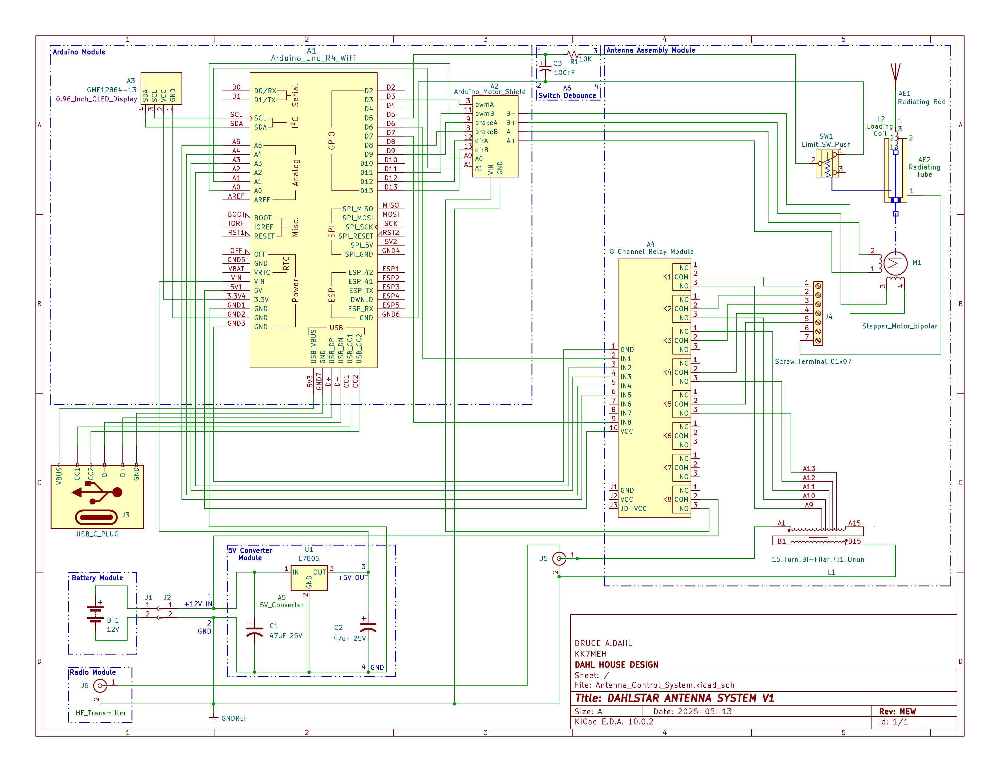

### 2.1 - Pin Connections

The pin connections between the system components shown in the schematic are included in the following tables.

#### 2.1.1 - A1: ARDUINO UNO R4 WIFI
| PIN   | TITLE         | COMPONENT              | ID | PIN  | NAME    | FUNCTION                   | COMMENT         |
|-------|---------------|------------------------|----|------|---------|----------------------------|-----------------|
| 3.3V4 | POWER 3.3V    | OLED DISPLAY           | A3 | 2    | VCC     | OLED DISPLAY 3.3V POWER IN |                 |
| 5V1   | POWER 5V      | 8 CHANNEL RELAY MODULE | A4 | 10   | VCC     | RELAY MODULE 5V POWER IN   |                 |
| 5V2   | SPI SPI_5V    |                        |    |      |         |                            | NOT USED        |
| 5V3   | USB USB_VBUS  | USB-C PLUG             | J3 | VBUS | VBUS    | ARDUINO USB INTERFACE      |                 |
| AREF  | AANALOG AREF  |                        |    |      |         |                            | NOT USED        |
| A0    | ANALOG A0     | ARDUINO MOTOR SHIELD   | A2 | A0   | A0      | CHANNEL A CURRENT SENSE    | ARDUINO SHIELD  |
| A1    | ANALOG A1     | ARDUINO MOTOR SHIELD   | A2 | A1   | A1      | CHANNEL B CURRENT SENSE    | ARDUINO SHIELD  |
| A2    | ANALOG A2     | 8 CHANNEL RELAY MODULE | A4 | 3    | IN2     | 10T UNUN TAP RELAY SIGNAL  | NORMALLY OPEN   |
| A3    | ANALOG A3     | 8 CHANNEL RELAY MODULE | A4 | 4    | IN3     | 11T UNUN TAP RELAY SIGNAL  | NORMALLY CLOSED |
| A4    | ANALOG A4     | 8 CHANNEL RELAY MODULE | A5 | 5    | IN4     | 12T UNUN TAP RELAY SIGNAL  | NORMALLY OPEN   |
| A5    | ANALOG A5     | 8 CHANNEL RELAY MODULE | A6 | 6    | IN5     | 13T UNUN TAP RELAY SIGNAL  | NORMALLY OPEN   |
| BOOT  | MISC BOOT     |                        |    |      |         |                            | NOT USED        |
| CC1   | USB CC1       | USB-C PLUG             | J3 | CC1  | CC1     | ARDUINO USB INTERFACE      |                 |
| CC2   | USB CC2       | USB-C PLUG             | J3 | CC2  | CC2     | ARDUINO USB INTERFACE      |                 |
| D-    | USB D-        | USB-C PLUG             | J3 | D-   | D-      | ARDUINO USB INTERFACE      |                 |
| D+    | USB D+        | USB-C PLUG             | J3 | D+   | D+      | ARDUINO USB INTERFACE      |                 |
| D0    | SERIAL D0/RX  |                        |    |      |         |                            | NOT USED        |
| D1    | SERIAL D1/TX  |                        |    |      |         |                            | NOT USED        |
| D2    | GPIO D2       |                        |    |      |         |                            | NOT USED        |
| D3    | GPIO D3       | ARDUINO MOTOR SHIELD   | A2 | 3    | PWMA    | CHANNEL A PWM SPEED        | ARDUINO SHIELD  |
| D4    | GPIO D4       |                        |    |      |         |                            | NOT USED        |
| D5    | GPIO D5       | SWITCH DEBOUNCE        | A6 | 1    | COM     | LIMIT SWITCH SENSE         | NORMALLY CLOSED |
| D6    | GPIO D6       | 8 CHANNEL RELAY MODULE | A4 | 2    | IN1     | 9T UNUN TAP RELAY SIGNAL   | NORMALLY OPEN   |
| D7    | GPIO D7       | 8 CHANNEL RELAY MODULE | A4 | 9    | IN8     | MOTOR POWER RELAY SIGNAL   | NORMALLY OPEN   |
| D8    | GPIO D8       | ARDUINO MOTOR SHIELD   | A2 | 8    | BRAKEB  | CHANNEL B BRAKE            | ARDUINO SHIELD  |
| D9    | GPIO D9       | ARDUINO MOTOR SHIELD   | A2 | 9    | BRAKEA  | CHANNEL A BRAKE            | ARDUINO SHIELD  |
| D10   | GPIO D10      |                        |    |      |         |                            | NOT USED        |
| D11   | GPIO D11      | ARDUINO MOTOR SHIELD   | A2 | 11   | PMWB    | CHANNEL B PWM SPEED        | ARDUINO SHIELD  |
| D12   | GPIO D12      | ARDUINO MOTOR SHIELD   | A2 | 12   | DIRA    | CHANNEL A DIRECTION        | ARDUINO SHIELD  |
| D13   | GPIO D13      | ARDUINO MOTOR SHIELD   | A2 | 13   | DIRB    | CHANNEL B DIRECTION        | ARDUINO SHIELD  |
| ESP1  | ESP ESP_42    |                        |    |      |         |                            | NOT USED        |
| ESP2  | ESP ESP_41    |                        |    |      |         |                            | NOT USED        |
| ESP3  | ESP ESP_TX    |                        |    |      |         |                            | NOT USED        |
| ESP4  | ESP DWNLD     |                        |    |      |         |                            | NOT USED        |
| ESP5  | ESP ESP_RX    |                        |    |      |         |                            | NOT USED        |
| GND1  | POWER GND     | 5V CONVERTER           | A5 | 4    | GND     | ARDUINO GROUND             |                 |
| GND2  | POWER GND     | OLED DISPLAY           | A3 | 1    | GND     | OLED DISPLAY GROUND        |                 |
| GND3  | POWER GND     | 8 CHANNEL RELAY MODULE | A4 | 1    | GND     | RELAY MODULE GROUND        |                 |
| GND4  | SPI SPI_GND   |                        |    |      |         |                            | NOT USED        |
| GND5  | POWER GND     |                        |    |      |         |                            | NOT USED        |
| GND6  | ESP GND       | SWITCH DEBOUNCE        | A6 | 2    | GND     | LIMIT SWITCH GROUND / NC   | NORMALLY CLOSED |
| GND7  | USB GND       | USB-C PLUG             | J3 | GND  | GND     | ARDUINO USB INTERFACE      |                 |
| IORF  | MISC IOREF    |                        |    |      |         |                            | NOT USED        |
| MISO  | SPI SPI_MISO  |                        |    |      |         |                            | NOT USED        |
| MOSI  | SPI SPI_MOSI  |                        |    |      |         |                            | NOT USED        |
| OFF   | POWER OFF     |                        |    |      |         |                            | NOT USED        |
| RST1  | MISC RESET    |                        |    |      |         |                            | NOT USED        |
| RST2  | SPI SPI_RESET |                        |    |      |         |                            | NOT USED        |
| SCL   | I2C SCL       | OLED DISPLAY           | A3 | 3    | SCL     | OLED DISPLAY DATA          |                 |
| SCK   | SPI SPI_SCK   |                        |    |      |         |                            | NOT USED        |
| SDA   | I2C SDA       | OLED DISPLAY           | A3 | 4    | SDA     | OLED DISPLAY DATA          |                 |
| VBAT  | POWER VRTC    |                        |    |      |         |                            | NOT USED        |
| VIN   | POWER VIN     | 5V CONVERTER           | A5 | 3    | +5V OUT | ARDUINO 5V POWER IN        |                 |

#### 2.1.2 - A2: ARDUINO MOTOR SHIELD
| PIN | TITLE  | COMPONENT              | ID | PIN  | NAME      | FUNCTION                    | COMMENT |
|-----|--------|------------------------|----|------|-----------|-----------------------------|---------|
| 3   | PWMA   | ARDUINO UNO R4 WIFI    | A1 | D3   | GPIO D3   | CHANNEL A PWM SPEED         |         |
| 8   | BRAKEB | ARDUINO UNO R4 WIFI    | A1 | D8   | GPIO D8   | CHANNEL B BRAKE             |         |
| 9   | BRAKEA | ARDUINO UNO R4 WIFI    | A1 | D9   | GPIO D9   | CHANNEL A BRAKE             |         |
| 11  | PWMB   | ARDUINO UNO R4 WIFI    | A1 | D11  | GPIO D11  | CHANNEL B PWM SPEED         |         |
| 12  | DIRA   | ARDUINO UNO R4 WIFI    | A1 | D12  | GPIO D12  | CHANNEL A DIRECTION         |         |
| 13  | DIRB   | ARDUINO UNO R4 WIFI    | A1 | D13  | GPIO D13  | CHANNEL B DIRECTION         |         |
| A0  | A0     | ARDUINO UNO R4 WIFI    | A1 | A0   | ANALOG A0 | CURRENT SENSE               |         |
| A1  | A1     | ARDUINO UNO R4 WIFI    | A1 | A1   | ANALOG A1 | CURRENT SENSE               |         |
| A+  | A+     | STEPPER MOTOR          | M1 | 1    | A+        | CHANNEL A POS               |         |
| A-  | A-     | STEPPER MOTOR          | M1 | 2    | A-        | CHANNEL A NEG               |         |
| B+  | B+     | STEPPER MOTOR          | M1 | 3    | B+        | CHANNEL B POS               |         |
| B-  | B-     | STEPPER MOTOR          | M1 | 4    | B-        | CHANNEL B NEG               |         |
| GND | GND    | BATTERY CONNECTOR      | J2 | 2    | NEG       | ARDUINO MOTOR SHIELD GROUND |         |
| VIN | VIN    | 8 CHANNEL RELAY MODULE | A4 | K8 3 | K8 NO     | STEPPER MOTOR +12V POWER    | RELAY 8 |

#### 2.1.3 - A3: 0.96 INCH OLED DISPLAY
| PIN | TITLE | COMPONENT           | ID | PIN   | NAME       | FUNCTION                   | COMMENT |
|-----|-------|---------------------|----|-------|------------|----------------------------|---------|
| 1   | GND   | ARDUINO UNO R4 WIFI | A1 | GND2  | POWER GND2 | OLED DISPLAY GROUND        |         |
| 2   | VCC   | ARDUINO UNO R4 WIFI | A1 | 3.3V4 | POWER 3.3V | OLED DISPLAY 3.3V POWER IN |         |
| 3   | SCL   | ARDUINO UNO R4 WIFI | A1 | SCL   | I2C SCL    |                            |         |
| 4   | SDA   | ARDUINO UNO R4 WIFI | A1 | SDA   | I2C SDA    |                            |         |

#### 2.1.4 - A4: 8 CHANNEL RELAY MODULE
| PIN  | TITLE  | COMPONENT            | ID | PIN  | NAME      | FUNCTION                    | COMMENT         |
|------|--------|----------------------|----|------|-----------|-----------------------------|-----------------|
| 1    | GND    | ARDUINO UNO R4 WIFI  | A1 | GND3 | POWER GND | 8 CHANNEL RELAY GROUND      |                 |
| 2    | IN1    | ARDUINO UNO R4 WIFI  | A1 | D6   | GPIO D6   | RELAY 1 SIGNAL              | NORMALLY OPEN   |
| 3    | IN2    | ARDUINO UNO R4 WIFI  | A1 | A2   | ANALOG A2 | RELAY 2 SIGNAL              | NORMALLY OPEN   |
| 4    | IN3    | ARDUINO UNO R4 WIFI  | A1 | A3   | ANALOG A3 | RELAY 3 SIGNAL              | NORMALLY CLOSED |
| 5    | IN4    | ARDUINO UNO R4 WIFI  | A1 | A4   | ANALOG A4 | RELAY 4 SIGNAL              | NORMALLY OPEN   |
| 6    | IN5    | ARDUINO UNO R4 WIFI  | A1 | A5   | ANALOG A5 | RELAY 5 SIGNAL              | NORMALLY OPEN   |
| 7    | IN6    |                      |    |      |           |                             | NOT USED        |
| 8    | IN7    |                      |    |      |           |                             | NOT USED        |
| 9    | IN8    | ARDUINO UNO R4 WIFI  | A1 | D7   | GPIO D7   | RELAY 8 SIGNAL              | NORMALLY OPEN   |
| 10   | VCC    | ARDUINO UNO R4 WIFI  | A1 | 5V1  | POWER 5V  | RELAY MODULE 5V POWER IN    |                 |
| K1 1 | K1 NC  |                      |    |      |           |                             | NOT USED        |
| K1 2 | K1 COM | ANTENNA BUS BAR      | J4 | 1    | 1         | 9T TAP ANTENNA SIGNAL OUT   | NORMALLY OPEN   |
| K1 3 | K1 NO  | UNUN                 | L1 | A9   | A9        | 9T TAP ANTENNA SIGNAL IN    | NORMALLY OPEN   |
| K2 1 | K2 NC  |                      |    |      |           |                             | NOT USED        |
| K2 2 | K2 COM | ANTENNA BUS BAR      | J4 | 2    | 2         | 10T TAP ANTENNA SIGNAL OUT  | NORMALLY OPEN   |
| K2 3 | K2 NO  | UNUN                 | L1 | A10  | A10       | 10T TAP ANTENNA SIGNAL IN   | NORMALLY OPEN   |
| K3 1 | K3 NC  | UNUN                 | L1 | A11  | A11       | 11T TAP ANTENNA SIGNAL OUT  | NORMALLY CLOSED |
| K3 2 | K3 COM | ANTENNA BUS BAR      | J4 | 3    | 3         | 11T TAP ANTENNA SIGNAL IN   | NORMALLY CLOSED |
| K3 3 | K3 NO  |                      |    |      |           |                             | NOT USED        |
| K4 1 | K4 NC  |                      |    |      |           |                             | NOT USED        |
| K4 2 | K4 COM | ANTENNA BUS BAR      | J4 | 4    | 4         | 12T TAP ANTENNA SIGNAL OUT  | NORMALLY OPEN   |
| K4 3 | K4 NO  | UNUN                 | L1 | A12  | A12       | 12T TAP ANTENNA SIGNAL IN   | NORMALLY OPEN   |
| K5 1 | K5 NC  |                      |    |      |           |                             | NOT USED        |
| K5 2 | K5 COM | ANTENNA BUS BAR      | J4 | 5    | 5         | 13T TAP ANTENNA SIGNAL OUT  | NORMALLY OPEN   |
| K5 3 | K5 NO  | UNUN                 | L1 | A13  | A13       | 13T TAP ANTENNA SIGNAL IN   | NORMALLY OPEN   |
| K6 1 | K6 NC  |                      |    |      |           |                             | NOT USED        |
| K6 2 | K6 COM |                      |    |      |           |                             | NOT USED        |
| K6 3 | K6 NO  |                      |    |      |           |                             | NOT USED        |
| K7 1 | K7 NC  |                      |    |      |           |                             | NOT USED        |
| K7 2 | K7 COM |                      |    |      |           |                             | NOT USED        |
| K7 3 | K7 NO  |                      |    |      |           |                             | NOT USED        |
| K8 1 | K8 NC  |                      |    |      |           |                             | NOT USED        |
| K8 2 | K8 COM | 5V CONVERTER         | A5 | 1    | +12V IN   | 12V POWER IN                | NORMALLY OPEN   |
| K8 3 | K8 NO  | ARDUINO MOTOR SHIELD | A2 | VIN  | VIN       | STEPPER MOTOR 12V POWER OUT | NORMALLY OPEN   |

#### 2.1.5 - A5: 5V CONVERTER
| PIN | TITLE   | COMPONENT              | ID | PIN  | NAME      | FUNCTION                  | COMMENT |
|-----|---------|------------------------|----|------|-----------|---------------------------|---------|
| 1   | +12V IN | BATTERY CONNECTOR      | J2 | 1    | +12V IN   | CONVERTER +12V INPUT      |         |
| 1   | +12V IN | 8 CHANNEL RELAY MODULE | A4 | K8 2 | K8 COM    | STEPPER MOTOR POWER RELAY | RELAY 8 |
| 2   | GND     | BATTERY CONNECTOR      | J2 | 2    | GND       | GROUND                    |         |
| 3   | +5V     | ARDUINO UNO R4 WIFI    | A1 | VIN  | POWER VIN | CONVERTER +5V OUTPUT      |         |
| 4   | GND     | ARDUINO UNO R4 WIFI    | A1 | GND1 | POWER GND | ARDUINO GROUND            |         |

#### 2.1.6 - A6: SWITCH DEBOUNCE (RC)
| PIN | TITLE | COMPONENT           | ID  | PIN  | NAME      | FUNCTION                  | COMMENT         |
|-----|-------|---------------------|-----|------|-----------|---------------------------|-----------------|
| 1   | COM   | ARDUINO UNO R4 WIFI | A1  | D5   | GPIO D5   | LIMIT SWITCH SENSE        |                 |
| 2   | GND   | ARDUINO UNO R4 WIFI | A1  | GND6 | ESP GND   | LIMIT SWITCH GROUND / NC  | NORMALLY CLOSED |
| 3   | COM   | LIMIT SWITCH        | SW1 | 2    | COM       | LIMIT SWITCH COMMON       |                 |
| 4   | GND   | ARDUINO UNO R4 WIFI | A1  | VIN  | POWER VIN | LIMIT SWITCH GROUND  / NC | NORMALLY CLOSED |

#### 2.1.7 - AE1: RADIATING ROD
| PIN | TITLE     | COMPONENT    | ID | PIN | NAME      | FUNCTION        | COMMENT |
|-----|-----------|--------------|----|-----|-----------|-----------------|---------|
| 1   | HF SIGNAL | LOADING COIL | L2 | 3   | HF SIGNAL | TUNED HF SIGNAL |         |

#### 2.1.8 - AE2: RADIATING TUBE
| PIN | TITLE     | COMPONENT              | ID | PIN | NAME        | FUNCTION                 | COMMENT |
|-----|-----------|------------------------|----|-----|-------------|--------------------------|---------|
| 1   | HF SIGNAL | SCREW TERMINAL BUS BAR | J4 | 7   | UNUN SIGNAL | FROM SELECTED TAP        |         |
| 2   | TAP       | LOADING COIL           | L2 | 2   | COIL TAP    | FINGERSTOCK CONTACT COIL |         |

#### 2.1.9 - BT1: 12V BATTERY
| PIN | TITLE   | COMPONENT                        | ID | PIN | NAME | FUNCTION          | COMMENT         |
|-----|---------|----------------------------------|----|-----|------|-------------------|-----------------|
| +   | CATHODE | BATTERY CONNECTOR (BATTERY SIDE) | J1 | 1   | +12V | +12V POWER SOURCE |                 |
| -   | ANODE   | BATTERY CONNECTOR (BATTERY SIDE) | J1 | 2   | GND  | GROUND            | NORMALLY CLOSED |

#### 2.1.10 - J1: BATTERY CONNECTOR (BATTERY SIDE)
| PIN | TITLE | COMPONENT         | ID  | PIN | NAME         | FUNCTION                        | COMMENT |
|-----|-------|-------------------|-----|-----|--------------|---------------------------------|---------|
| 1   | +12V  | BATTERY CONNECTOR | J2  | 1   | +12V         | STEPPER POWER / 5V CONVERTER IN |         |
| 1   | +12V  | BATTERY           | BT1 | +   | POS TERMINAL | +12V SOURCE                     |         |
| 2   | GND   | BATTERY CONNECTOR | J2  | 2   | GND          | GND                             |         |
| 2   | GND   | BATTERY           | BT1 | -   | NEG TERMINAL | GND                             |         |

#### 2.1.11 - J2: BATTERY CONNECTOR (SYSTEM SIDE)
| PIN | TITLE | COMPONENT         | ID | PIN | NAME    | FUNCTION                        | COMMENT |
|-----|-------|-------------------|----|-----|---------|---------------------------------|---------|
| 1   | +12V  | BATTERY CONNECTOR | J1 | 1   | +12V    | +12V SOURCE                     |         |
| 1   | +12V  | BATTERY           | A5 | 1   | +12V IN | STEPPER POWER / 5V CONVERTER IN |         |
| 2   | GND   | BATTERY CONNECTOR | J1 | 2   | GND     | GND                             |         |
| 2   | GND   | BATTERY           | A5 | 2   | GND     | GND                             |         |

#### 2.1.12 - J3: USB-C PLUG
| PIN  | TITLE    | COMPONENT           | ID | PIN  | NAME         | FUNCTION | COMMENT    |
|------|----------|---------------------|----|------|--------------|----------|------------|
| CC1  | USB CC1  | ARDUINO UNO R4 WIFI | A1 | CC1  | USB USB_CC1  |          | USB JUMPER |
| CC2  | USB CC2  | ARDUINO UNO R4 WIFI | A1 | CC2  | USB USB_CC2  |          | USB JUMPER |
| D-   | USB D-   | ARDUINO UNO R4 WIFI | A1 | D-   | USB USB_DN   |          | USB JUMPER |
| D+   | USB D+   | ARDUINO UNO R4 WIFI | A1 | D+   | USB USB_DP   |          | USB JUMPER |
| GND  | USB GND  | ARDUINO UNO R4 WIFI | A1 | GND  | USB GND      |          | USB JUMPER |
| VBUS | USB VBUS | ARDUINO UNO R4 WIFI | A1 | VBUS | USB USB_VBUS |          | USB JUMPER |

#### 2.1.13 - J4: SCREW TERMINAL BUS BAR
| PIN | TITLE | COMPONENT              | ID  | PIN  | NAME   | FUNCTION          | COMMENT  |
|-----|-------|------------------------|-----|------|--------|-------------------|----------|
| 1   | 1     | 8 CHANNEL RELAY MODULE | A4  | K1 2 | K1 COM | T9 TAP SIGNAL     |          |
| 2   | 2     | 8 CHANNEL RELAY MODULE | A4  | K2 2 | K2 COM | T10 TAP SIGNAL    |          |
| 3   | 3     | 8 CHANNEL RELAY MODULE | A4  | K3 2 | K3 COM | T11 TAP SIGNAL    |          |
| 4   | 4     | 8 CHANNEL RELAY MODULE | A4  | K4 2 | K4 COM | T12 TAP SIGNAL    |          |
| 5   | 5     | 8 CHANNEL RELAY MODULE | A4  | K5 2 | K5 COM | T13 TAP SIGNAL    |          |
| 6   | 6     |                        |     |      |        |                   | NOT USED |
| 7   | 7     | RADIATING TUBE         | AE2 | 1    | 1      | ANTENNA SIGNAL IN |          |

#### 2.1.14 - J5: SO239 ANTENNA CONNECTOR
| PIN | TITLE  | COMPONENT                       | ID | PIN | NAME   | FUNCTION  | COMMENT |
|-----|--------|---------------------------------|----|-----|--------|-----------|---------|
| 1   | CORE   | SO239 HF TRANSMITTER  CONNECTOR | J6 | 1   | CORE   | HF SIGNAL |         |
| 1   | CORE   | UNUN                            | L1 | A1  | IN     | HF SIGNAL |         |
| 2   | SHIELD | SO239 HF TRANSMITTER  CONNECTOR | J6 | 2   | SHIELD | GROUND    |         |
| 2   | SHIELD | UNUN                            | L1 | B15 | GND    | GROUND    |         |
| 2   | SHIELD | BATTERY CONNECTOR               | J2 | 2   | GND    | GROUND    |         |

#### 2.1.15 - J6: SO239 HF TRANSMITTER CONNECTOR
| PIN | TITLE  | COMPONENT               | ID | PIN | NAME   | FUNCTION  | COMMENT |
|-----|--------|-------------------------|----|-----|--------|-----------|---------|
| 1   | CORE   | SO239 ANTENNA CONNECTOR | J5 | 1   | CORE   | HF SIGNAL |         |
| 2   | SHIELD | SO239 ANTENNA CONNECTOR | J5 | 2   | SHIELD | GROUND    |         |

#### 2.1.16 - L1: UNUN COIL
| PIN | TITLE   | COMPONENT               | ID | PIN  | NAME    | FUNCTION     | COMMENT          |
|-----|---------|-------------------------|----|------|---------|--------------|------------------|
| A1  | A START | SO239 ANTENNA CONNECTOR | J5 | 1    | CORE    | HF SIGNAL    | FROM TRANSMITTER |
| A9  | 9T TAP  | 8 CHANNEL RELAY MODULE  | A4 | K1 3 | K1 NO   | 9T UNUN TAP  | NORMALLY OPEN    |
| A10 | 10T 10  | 8 CHANNEL RELAY MODULE  | A4 | K2 3 | K2 NO   | 10T UNUN TAP | NORMALLY OPEN    |
| A11 | 11T TAP | 8 CHANNEL RELAY MODULE  | A4 | K3 1 | K3 NC   | 11T UNUN TAP | NORMALLY CLOSED  |
| A12 | 12T TAP | 8 CHANNEL RELAY MODULE  | A4 | K4 3 | K4 NO   | 12T UNUN TAP | NORMALLY OPEN    |
| A13 | 13T TAP | 8 CHANNEL RELAY MODULE  | A4 | K5 3 | K5 NO   | 13T UNUN TAP | NORMALLY OPEN    |
| A15 | A END   | UNUN COIL               | L1 | B1   | B START |              | INTERNAL TO UNUN |
| B1  | B START | UNUN COIL               | L1 | A15  | A END   |              | INTERNAL TO UNUN |
| B15 | B END   | SO239 ANTENNA CONNECTOR | J5 | 2    | SHIELD  | GROUND       | FROM TRANSMITTER |

#### 2.1.17 - L2: LOADING COIL
| PIN | TITLE  | COMPONENT      | ID  | PIN | NAME      | FUNCTION                 | COMMENT |
|-----|--------|----------------|-----|-----|-----------|--------------------------|---------|
| 1   | OPEN   |                |     |     |           |                          |         |
| 2   | TAP    | RADIATING TUBE | AE2 | 2   | COIL TAP  | FINGERSTOCK CONTACT COIL |         |
| 3   | OUTPUT | RADIATING ROD  | AE1 | 1   | HF SIGNAL | TUNED HF SIGNAL          |         |

#### 2.1.18 - M1: STEPPER MOTOR
| PIN | TITLE | COMPONENT            | ID | PIN | NAME | FUNCTION      | COMMENT |
|-----|-------|----------------------|----|-----|------|---------------|---------|
| 1   | A+    | ARDUINO MOTOR SHIELD | A2 | A+  | A+   | CHANNEL A POS |         |
| 2   | A-    | ARDUINO MOTOR SHIELD | A2 | A-  | A-   | CHANNEL A NEG |         |
| 3   | B+    | ARDUINO MOTOR SHIELD | A2 | B+  | B+   | CHANNEL B POS |         |
| 4   | B-    | ARDUINO MOTOR SHIELD | A2 | B-  | B-   | CHANNEL B NEG |         |

#### 2.1.19 - SW1: LIMIT SWITCH
| PIN | TITLE | COMPONENT            | ID | PIN | NAME     | FUNCTION                | COMMENT         |
|-----|-------|----------------------|----|-----|----------|-------------------------|-----------------|
| 1   | NC    | SWITCH DEBOUNCE (RC) | A6 | 4   | NO / GND | GROUND                  |                 |
| 2   | COM   | SWITCH DEBOUNCE (RC) | A6 | 3   | SENSE    | LIMIT SWITCH SENSE / NC | NORMALLY CLOSED |
| 3   | NO    |                      |    |     |          |                         | NOT USED        |

## 3 - Component Data

Specifications and costs for all components are included in this section.

### 3.1 - Electronics

#### 3.1.1 - A1: Arduino Uno RF WiFi Controller

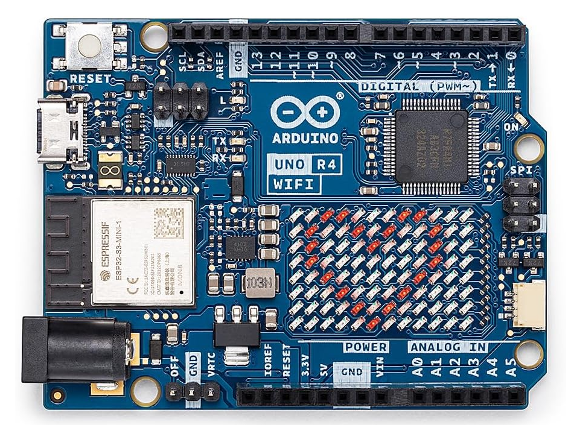

[Arduino Uno R4 WiFi Datasheet / User's Manual](../Datasheets/Arduino_R4_WiFi_Datasheet.pdf)

[Arduino Uno R4 WiFi Pinouts](../Datasheets/Arduino_R4_WiFi-full-pinout.pdf)

[Arduino Uno R4 Wifi Schematics](../Datasheets/Arduino_R4_WiFi-schematics.pdf)

Approximate Cost: $27.50 (Amazon)

#### 3.1.2 - A2: Arduino Motor Controller Shield R3 

[Arduino Motor Controller Shield R3 Schematic](../Datasheets/Arduino_Motor_Controller_R3-schematic.pdf)

Approximate Cost: $28.40 (Amazon)

#### 3.1.3 - A3: Hosyond 0.96 Inch OLED I2C Display Module 

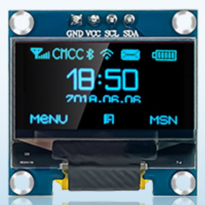

[Hosyond GME12864-13 Datasheet](<../Datasheets/OLED 4 Pin 128x64 Display module 0.96 inch blue color.pdf>)

Approximate Cost: $13.48 (Amazon, 5 units)

#### 3.1.4 - A4: Elegoo 8 Channel Relay Module

[Elegoo 8 Channel Relay Module Datasheet](<../Datasheets/8 CHANNEL 5V 10A RELAY MODULE.pdf>)

[Relay Datasheet](../Datasheets/SRD-05VDC-SL-C.pdf)

[Elegoo 8 Channel Relay Module Schematic](<../Datasheets/8 Channel DC 5V Relay Module with Optocoupler Schematic diagram.pdf>)

[Elegoo 8 Channel Relay Module Dimensions](<../Datasheets/8 way photocoupler with size chart.pdf>)

Approximate Cost: $8.99 (Amazon)

#### 3.1.5 - A5: 5V Converter Module

Although they can be purchased, the 12V to 5V voltage converter for this implementation was custom assembled using the following components: 

* U1 - L7805 5V Voltage Regulator
* C1 - 47uF 25V Electrolytic Capacitor
* C2 - 47uf 25V Electrolytic Capacitor
* TO220 Heat Sink
* Proto Board

Approximate Cost (Amazon):
* $3.00 (Custom)
* $10.00-$15.00 (If purchased complete)

#### 3.1.6 - A6: Limit Switch Debounce

Although software-only debouncing of the limit switch may be sufficient for this application, given the low RPM output of the geared stepper motor, an RC circuit was chosen for addded robustness. This will best ensure that the mechanism never overshoots the switch with resulting damage. The components used in the RC circuit are:

* R1 - 10K Ohm 1/4W Resistor
* C3 = 100nF Ceramic Capacitor

Approximate Cost: $0.25 

#### 3.1.7 - J1 / J2: SZJELEN SP21 2-Pin Panel Mount 21mm Waterproof Connector

 
Approximate Cost: $9.20 (Amazon)

#### 3.1.8 - J3: USB-C Connector / Jumper

Approximate Cost: $9.69 (Amazon)

#### 3.1.9 - J4: Screw Terminal Bus Bar
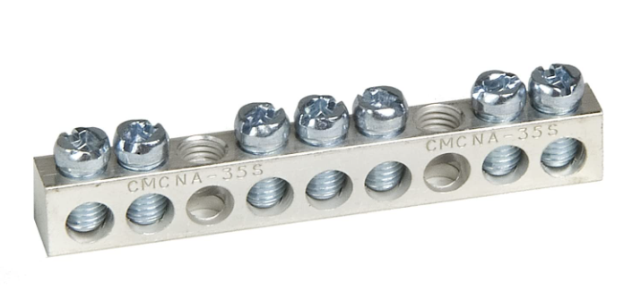

Note: Although it is officially named as a ground bar, it is not being used for grounding in this system. Instead, it is used to capture the signal from whatever unun tap is active.

Approximate Cost: $8.98 (Amazon)

#### 3.1.10 - J5: SO239 Antenna Connector

Approximate Cost: $8.99 (Amazon, 4 units)

#### 3.1.11 - J6: SO239 Radio Connector
Included for completeness only, as this is built in to the transceiver radio.

#### 3.1.12 - L1: Multi-Tap UNUN Coil
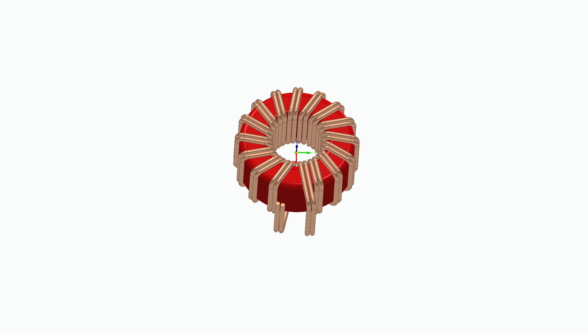

Note: The above is a simplified incomplete cad image of the assembly. It does not show the winding A to winding B connection, and does not show the taps. At this time, there is no image available of the completed assembly, as the builder installed it prior to photographing it.

The unun requires fabrication from the following:

##### 3.1.12.1 - UNUN Core

Approximate Cost: $5.99 (Amazon, 5 units)

##### 3.1.12.2 - 18 GA Enameled Wire
  

Approximate Cost: $29.90 (Amazon, 202 feet)

Note: Only a very small amount of this wire is actually needed for a 15 turn bi-filar unun of this size, so smaller a smaller purchase quantity is recommended if available. Also, don't forget to sand off the enamal wire insulation wherever an alectrical connection is made.

##### 3.1.12.3 - 1/4-Inch Tab Terminals
These are used for the unun taps at winding 9, 10, 11, 12 and 13. Install on the approporiate winding wire on the outside of the coil. Be sure to sand off the enamal insulation from the wire at the installation locations. Crimp the connector over the wire and add solder. The connectors may loosen up without the solder. Other tapping methods may be used instead. Do whatever you are comfortable with.

Approximate Cost: $10.00 (Local hardware store) - Includes packages of the male and female tab connectors (female used on the connecting wires).

#### 3.1.13 - L2: Loading Coil Form Assembly
The loading coil form assembly is fabricated by bonding together 4 coil form segments. The design of these segments are mistake-proofed with unique tab and slot configurations that insure the alignment of the helical grove endings in each. Carefully sand the tabs and debur the slots to prevent fracture during assembly.

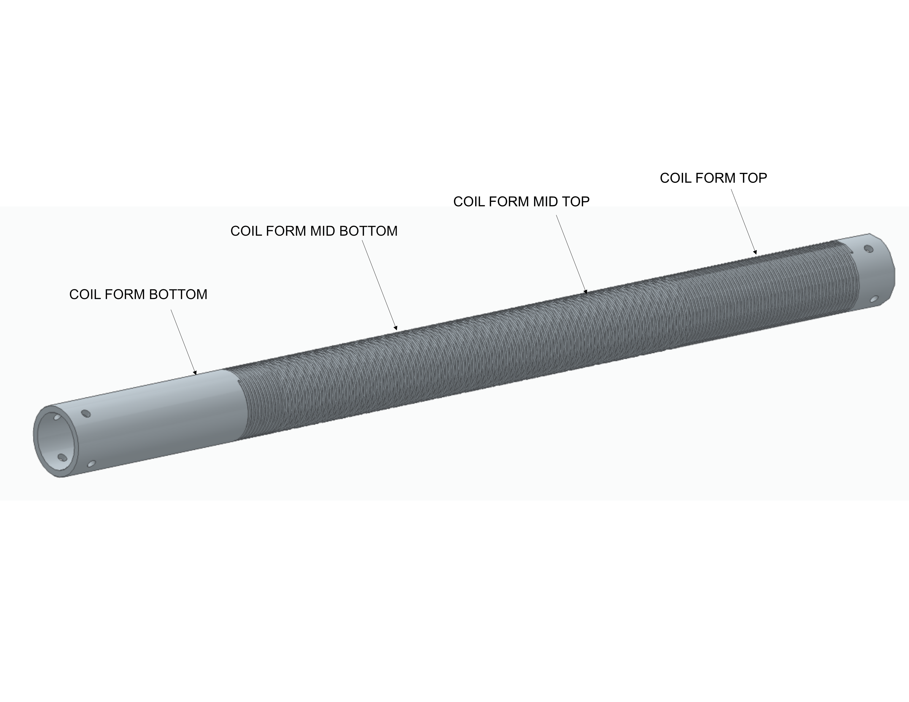

##### 3.1.13.1 - Coil Form Bottom:

Recommended Material: ASA (57.37 g, no supports needed)

Approximate Cost: $3.00

##### 3.1.13.2 - Coil Form Mid Bottom:

Recommended Material: ASA (57.57 g, no supporte needed)

Approximate Cost: $3.00

##### 3.1.13.3 - Coil Form Mid Top:

Recommended Material: ASA (57.70 g, no supports needed)

Approximate Cost: $3.00

##### 3.1.13.4 - Coil Form Top:
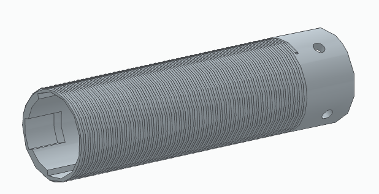

Recommended Material: ASA (54.29 g, no supports needed)

Approximate Cost: $3.00

#### 3.1.14 - Coil Form Support Tube Assembly
A 1-inch PVC pipe is assembled with the loading coil form assembly to provide structural support for both the loading coil and the emitting rod.
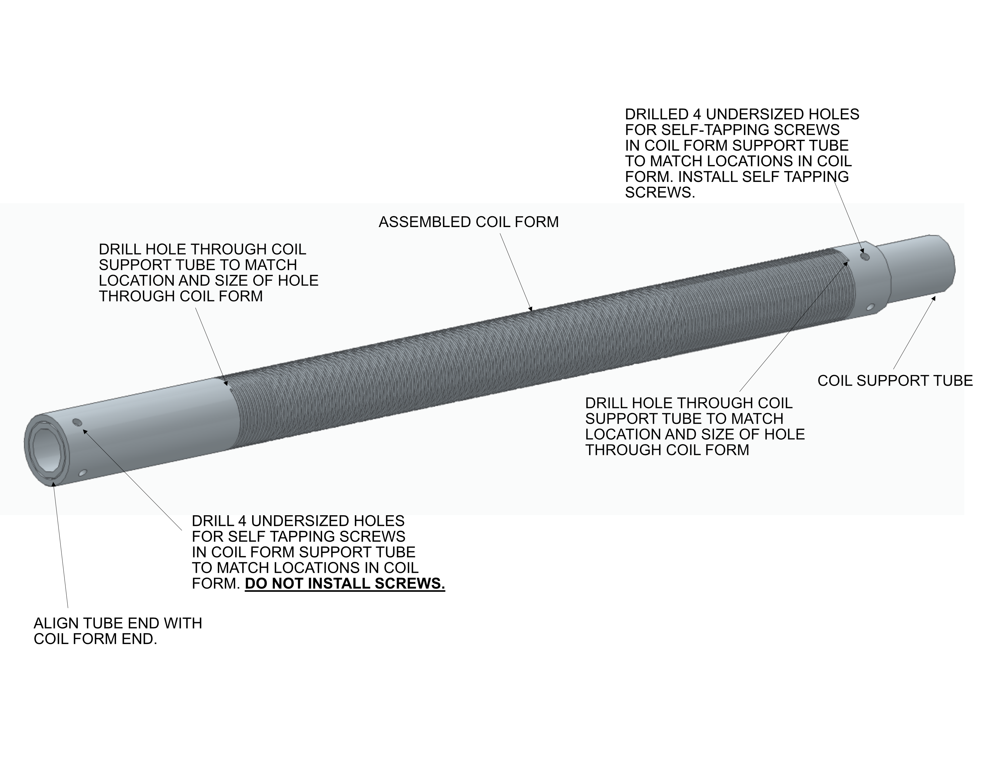
16 GA bare copper wire is wound over the helical groove in the coil form assembly to complete the loading coil assembly.

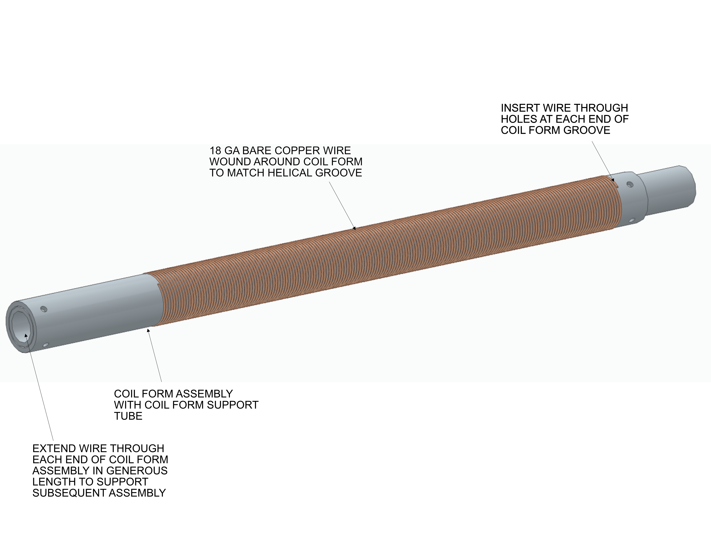

##### 3.1.14.1 - 18 GA Bare Copper Wire

Amount Needed: 100 ft

Approximate Cost: $25.00 (Amazon)

#### 3.1.15 - M1: Stepperonline NEMA 17 27:1 Geared Stepper Motor

The 27:1 gear reduction being used is probably excessive, but for the initial implementation, it was chosen to make sure that there will be sufficient torque to operate the antenna. Future implementations should consider reducing the gear ratio in the interest of faster tuning performance.

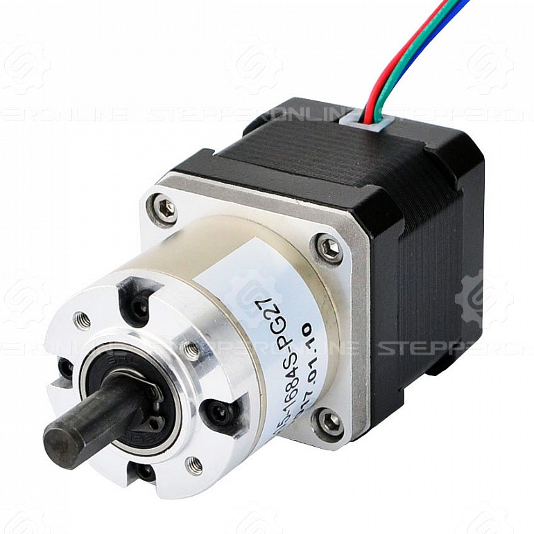

[17HS15-1684S-PG27 Datasheet](../Datasheets/17HS19-1684S-PG27_Full_Datasheet.pdf)

[17HS15-1684S-PG27 Torque Curve](../Datasheets/17HS19-1684S-PG27_Torque_Curve.pdf)

Approximate Cost: $41.91 (Amazon) 

#### 3.1.16 - SW1: HiLetgo Micro Limit Switch

Approximate Cost: $5.99 (Amazon, 10 units)

### 3.2 - Other Hardware
The hardware in this section is presented in the order of recommended assemmbly. Although the fastening hardware (bolts, screws, nuts, etc.) is mentioned, exact sizes and lengths can be chosen based on availablity. All are designed to be 1/4 inch diameter or smaller. Only the stepper motor attachment requires metric (3 mm).

#### 3.2.1 - Carriage Assembly
The carriage assembly includes a carriage, and a lead screw nut (component of the lead screw assembly). 

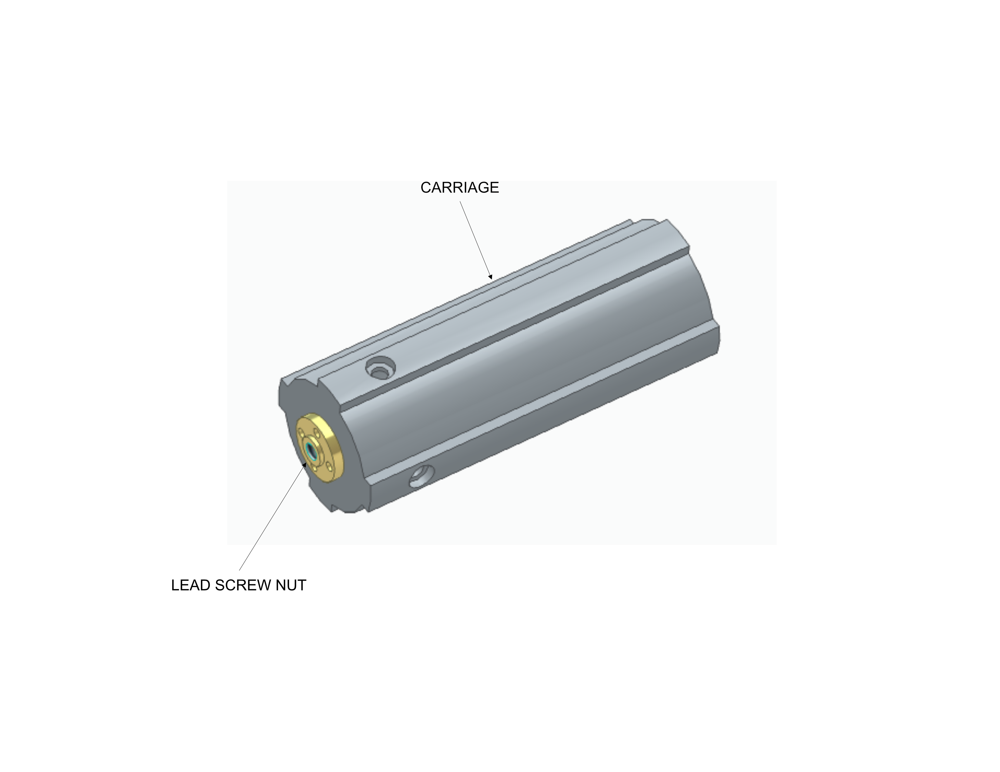

The carriage assembly attaches to the loading coil assembly with the 4 tab features engaging with slots in the inner sleeve assembly to prevent antenna rotation during extension and retraction. This is a significant benefit of this design versus classic screwdriver antenna implementations.

##### 3.2.1.1 - Carriage
The carriage is 3D printed.

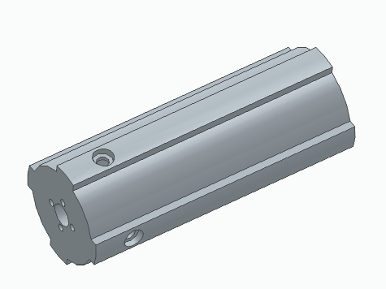

Recommended Material: ASA (48.18 g, no supports needed)

Approximate Cost: $3.00

##### 3.2.1.2 - Lead Screw Nut
See the seperate lead screw assembly section for details.

#### 3.2.2 - Inner Sleeve Assembly
The inner sleeve assembly consists of a sleeve made by bonding 4 3D printed sections, and the limit switch. Tabs and slots are provided to facilitate assembly of the sleeve. Carefully sand the tabs and deburr the slOts to prevent fracture during assembly.

##### 3.2.2.1 - Inner Sleeve Bottom
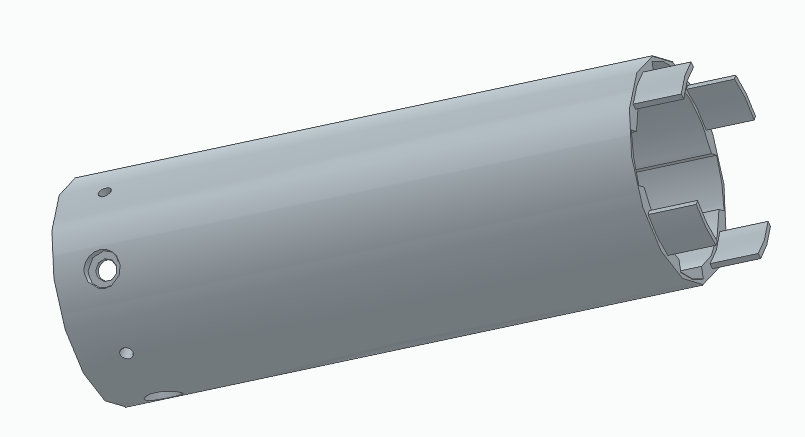

Recommended Material: ASA (77.08 g, no supports needed)

Approxiamte Cost: $4:00

##### 3.2.2.2 - Inner Sleeve Mid Bottom

Recommended Material: ASA (68.51 g, no supports needed)

Approximate Cost: $4.00

##### 3.2.2.3 - Inner Sleeve Mid Top

Recommended Material: ASA (68.51 g, no supports needed)

Approximate Cost: $4.00

##### 3.2.2.4 - Inner Sleeve Top

Recommended Material: ASA (67.25 g, no supports needed)

Approximate Cost: $4.00

#### 3.2.3 - Stepper Motor Installation
The stepper motor is attached to the motor attach fitting, which is then attached to the inner sleeve assembly. The stepper motor shaft is attached to the leadscrew coupling. The leadscrew is engaged with the leadscrew nut of the carriage (attached to the loading coil assembly). The leadscrew/carriage/loading coil is then inserted into the inner sleeve assembly until the leadscrew engages with the leadscrew coupling. 

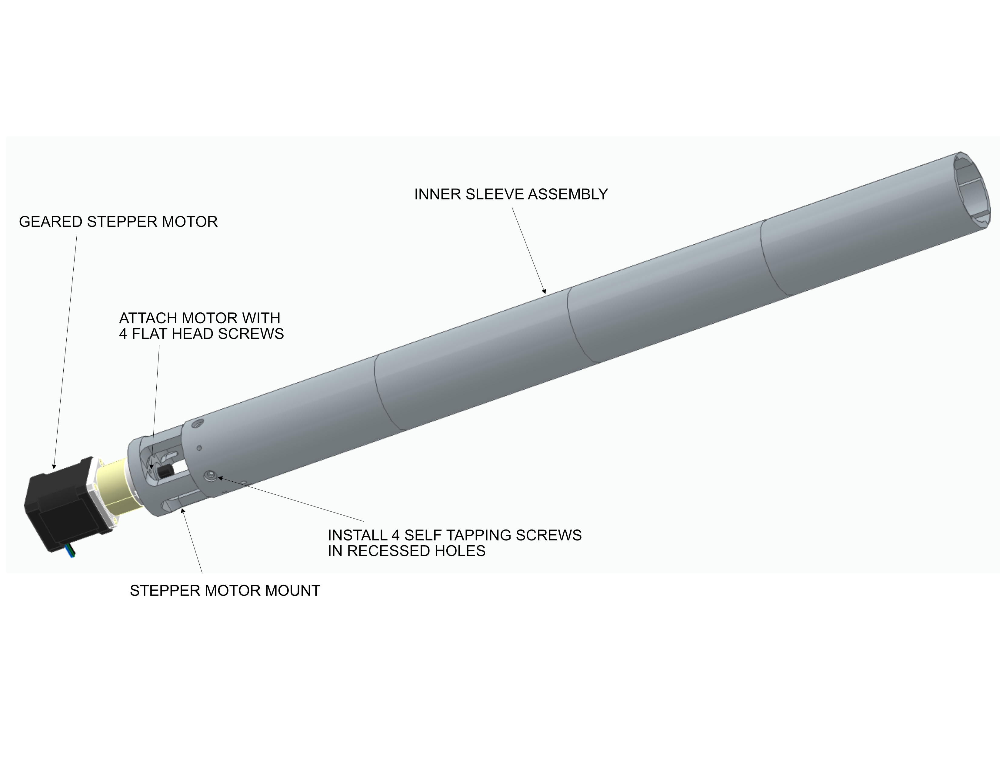

##### 3.2.3.1 - Motor Attach Fitting
The motor attach fitting is 3D printed. It has 4 holes/slots for routing the wires from the limit switch (2 wires) and for the wire connecting the HF signal wire from the screw terminal bus bar to the emitting tube.

Recommended Material: ASA (26.62 g, support needed for motor recess on bottom)

Approximate Cost: $2.00

##### 3.2.3.2 - Leadscrew Assembly
550mm T8 Tr8x8 Lead Screw and Brass Nut (Acme Thread, 2mm Pitch, 4 Starts, 8mm Lead).

Manufacturer: ReliaBot

Part Number: 	EU-RZ007-37

Approximate Cost: $18.59 (Amazon)

##### 3.2.3.3 - Leadscrew Coupling
8mm to 8mm Stepper Motor Shaft Coupling 30mm Length 25mm Diameter Shaft Coupler Aluminum Alloy Joint Connector.

Manufacturer: Sinoblu

Part Number: 	RL-A-2530-8-8

Approximate Cost: $14.99 (Amazon, 2 units)

#### 3.2.4 - 8 Channel Relay Module and Screw Terminal Bus Bar Installation
The 8 channel relay module and the screw terminal bus bar are both attached to the relay module mount fitting.

##### 3.2.4.1 - Relay Module Mount Fitting
The relay module mount fitting is 3D printed and include holes to facilitate wire connections to the screw terminal bus bar.

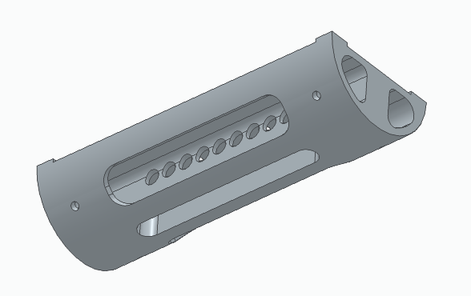

Recommended Material: ASA (51.12 g, no supports needed)

Approximate Cost: $3.00

#### 3.2.5 - Radiating Tube Installation
The radiating tube is assembled to the inner sleeve assembly (with stepper motor and limit switch), the lead screw, the loading coil assembly (with carriage and lead screw nut), and the fingerstock element. The portion of the loading coil enclosed by the radiating tube is inert, as the tube shields it.

##### 3.2.5.1 - Radiating Tube
Although this implementation used a galvanized steel cyclone fence post segment due to low cost and availability, any metal tube having an outside dimension of 2.375 inches and an inside diameter of 2.250 inches will be compatible with this design. A 3D printed drill guide tool is provided to aid in locating the holes for the tube.

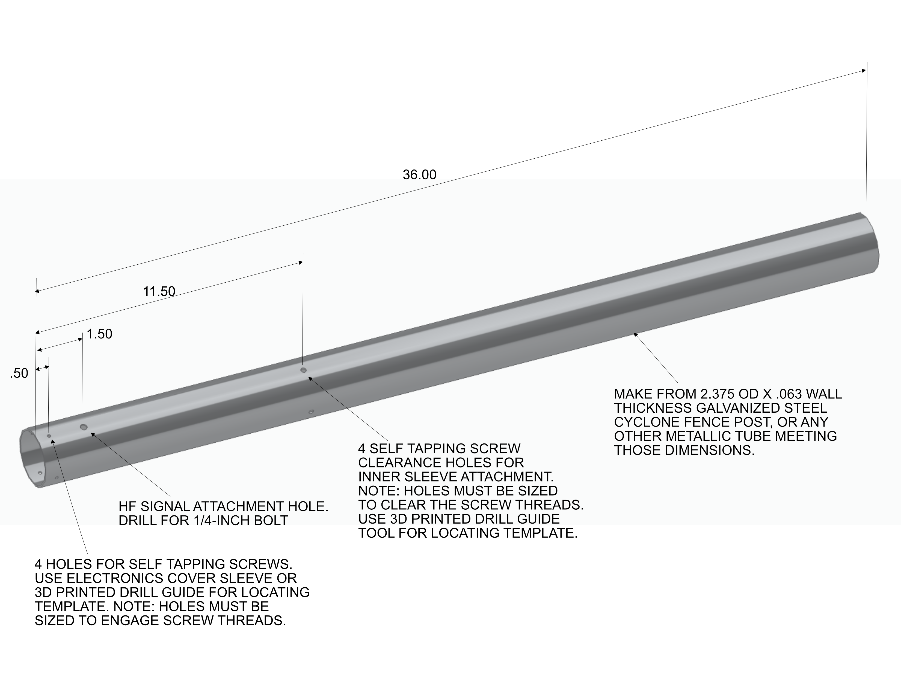

##### 3.2.5.2 - Fingerstock
The fingerstock provides the electrical connection between the radiating tube and the loading coil. Through contact, it taps the loading coil at whatever coil winding is present common to the fingerstock contact. 

Manufacturer: Leader Tech Inc.

Part Number: [25-78FS-BD-24 (Datasheet)](../Datasheets/25-78FS-BD-24_Fingerstock.pdf)

Approximate Cost: $28.33 (DigiKey, 24 inch length)

Other fingerstock styles / methods may be used to facilitate coil tapping.

#### 3.2.6 - Electronics Cover Sleeve Installation
The electronics cover sleeve houses the 8 channel relay module and its mount fitting. It attaches to the radiating tube. Wires from the stepper motor and the limit switch pass through the sleeve as well. 

##### 3.2.6.1 - Electronics Cover Sleeve
The electronics cover sleeve is 3D printed. Given the environment and handling, it is intentionally robust.

Recommended Material: ASA (222.01 g, no supports needed)

Approximate Cost: $11.00

#### 3.2.7 - UNUN Housing Installation
The unun housing installation attaches the unun housing and the multi-tap unun. It is assembled to the electronics cover sleeve. Route remaining wires through the openings in the end of the housing.

##### 3.2.7.1 - UNUN Housing
The unun housing is 3D printed, robustly design per previously mentioned reasons.

#### 3.2.8 - Electronics Housing Assembly Installation
The electronics housing assembly consists of the electroncis housing, the arduino uno R4 wifi, the arduino motor controller, the 5V converter, the OLED display, the USB-C connector, the 12V power connector, and the SO239 antenna connector. It is assembled to the unun housing.

Assemble the electronics components in the electronics housing using screws (normal and self tapping) and nuts (as needed).

##### 3.2.8.1 - Electronics Housing
The robustly designed electronics housing is 3D printed.

Recommended Material: ASA (11.64 g, no supports needed)

Approximate Cost: $12.00

#### 3.2.8 - Radiating Rod Installation
The radiating rod is the downstream radiating element from the loading coil. It is assembled to the loading coil assembly with TBD parts, and is electrically connected to the loading coil wire.

##### 3.2.8.1 - Radiating Rod
TBD

##### 3.2.8.2 - Radiating Rod Attach Fitting
TBD

## Software

### Overview

Two software applications are required for the system. The first application is to be native to the Arduino Uno R4 WiFi controller, developed using the PlatformIO extension in Visual Studio Code. The second application is the user interface to the system to be native to a macOS M5 Macbook Pro laptop, developed using Xcode and the Swift/SwiftUI programming language. Communication between the applications is to be acomplished via Bluetooth (primary), WiFi (secondary) and wired USB (tertiary).

### Arduino Controller Application Functionality

1. Automatically connect to the User Interface Application in the active mode made avaliable by it.
2. Establish knowledge of the antenna extension position. If unknown, initiate retraction to the home position as verified by the Limit Switch position.
3. Maintain knowledge of the antenna extension position at all times, preventing the translation from exceeding the maximum extended position. This position is to be established by a constant value to be compared to the stepper mootor count relative to the home position.
4. Respond to extension, retraction, and calibration (to home position) commands from the User Interface Application.
5. Send and hold the signals to the Relay Module as appropriate in response to Unun Tap switch commands from the User Interface Application. Note that the default 11T tap is wired to the relay normally closed position. All others are wired to the normally open position. When switching away from the default tap, the relay for the 11T tap must be switched to the normally open position along with the selected tap relay. This will disengage the default tap while engaging the selected tap.
6. Respond to Stepper Motor on/off commands sent from the User Interface Application by sending and signals to the Relay Module for the relay wired to it. For a power on condition, the signal must be held to keep the power on. For the power off condition (default), the signal does not need to be held.

#### Notes:

1. A small OLED display (GM12864-13) is wired to the Arduino controller, and is available for appropriate status/information displays.
2. The Arduino Motor Controller is a shield, connected directly to the Arduino Uno controller.

### User Interface Application Functionality

1. The user interface must be professional, polished and conform to any and all Apple software development guidlines.
2. Initiate and establish connection to the Arduino Controller Application in whatever mode the user has selected.
3. Provide appropriate methods for the user to extend, retract and calibrate (to the home position) the antenna.
4. Provide visual indication of the current antanna postion.
5. Provide a visual means to switch the Unun tap selection.
6. Provide a visual means to switch the Stepper Motor power on/off.
